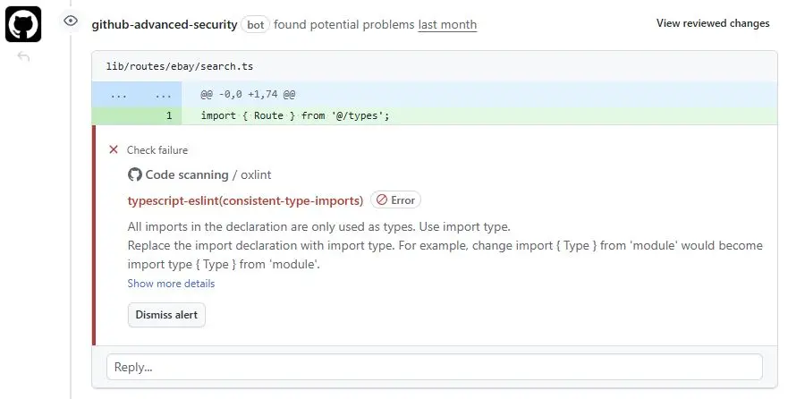

# oxlint-json-to-sarif

[](https://www.npmjs.com/package/oxlint-json-to-sarif)
[](https://www.npmjs.com/package/oxlint-json-to-sarif)
[](https://github.com/TonyRL/oxlint-json-to-sarif/actions/workflows/ci.yml)
[](https://opensource.org/licenses/MIT)

Convert oxlint JSON output to Static Analysis Results Interchange Format (SARIF) for [Github Code Scanning](https://docs.github.com/en/code-security/reference/code-scanning/sarif-files/sarif-support-for-code-scanning).

## Usage

### File Input

```bash
npx oxlint-json-to-sarif --input oxlint-output.json --output results.sarif
```

### stdin

```bash
oxlint --format json | npx oxlint-json-to-sarif --output results.sarif
```

### stdout

```bash
npx oxlint-json-to-sarif --input oxlint-output.json > results.sarif
```

### Aliases

```bash
npx oxlint-json-to-sarif -i oxlint-output.json -o results.sarif
```

## CLI Options

- --input `<path>`, -i `<path>`: path to the oxlint JSON input file
- --output `<path>`, -o `<path>`: path to write SARIF output (defaults to stdout)
- --help: show help
- --version: show version

## GitHub Actions Usage

```yaml
# Similar to https://github.com/actions/starter-workflows/blame/main/code-scanning/eslint.yml
name: Oxlint

on:
  push:
  pull_request:

jobs:
  oxlint:
    runs-on: ubuntu-latest
    permissions:
      contents: read
      security-events: write
    steps:
      - uses: actions/checkout@v6
      - uses: actions/setup-node@v6
        with:
          node-version: lts/*
      - name: Run oxlint
        run: |
          npx oxlint --format json | npx oxlint-json-to-sarif --output results.sarif
        continue-on-error: true
      - uses: github/codeql-action/upload-sarif@v4
        with:
          sarif_file: results.sarif
          wait-for-processing: true
```

## Node.js Usage

```ts
import { convertOxlintToSarif } from 'oxlint-json-to-sarif';
import { readFile, writeFile } from 'node:fs/promises';

const json = await readFile('oxlint-output.json', 'utf-8');
const sarif = convertOxlintToSarif(json);
await writeFile('results.sarif', sarif, 'utf-8');
```

## Rationale

<details>
<summary>Click to expand</summary>

### Problem

While oxlint's [`github` output format](https://oxc.rs/docs/guide/usage/linter/output-formats.html#format-github) can surface lint results as annotations in the **Files changed** tab of a pull request:


These annotations only appear in the **Files changed** tab. Contributors who are new to GitHub are often unfamiliar with this interface and may not notice the annotations until a project maintainer points them out, extending the review cycle of a pull request.

### Solution

SARIF scan results, on the other hand, are shown directly on the **Conversation** tab, which is the default view when opening a pull request. This means contributors can see lint results immediately and fix them right away, without needing a reminder from maintainers.

<picture>
  <source media="(prefers-color-scheme: dark)" srcset=".github/image/scan-dark.webp">
  <source media="(prefers-color-scheme: light)" srcset=".github/image/scan.webp">
  
</picture>

Once the lint issues are fixed, the annotations are automatically collapsed:

<picture>
  <source media="(prefers-color-scheme: dark)" srcset=".github/image/scan-fixed-dark.webp">
  <source media="(prefers-color-scheme: light)" srcset=".github/image/scan-fixed.webp">
  
</picture>

</details>

## Development

```bash
pnpm install
pnpm build
pnpm test
```

## License

MIT
